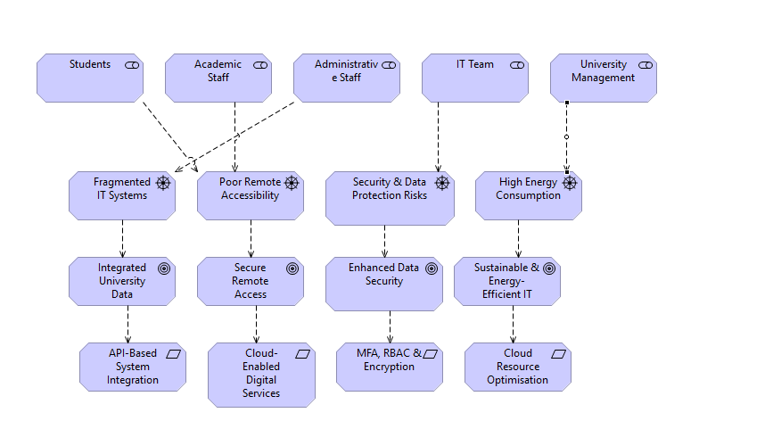
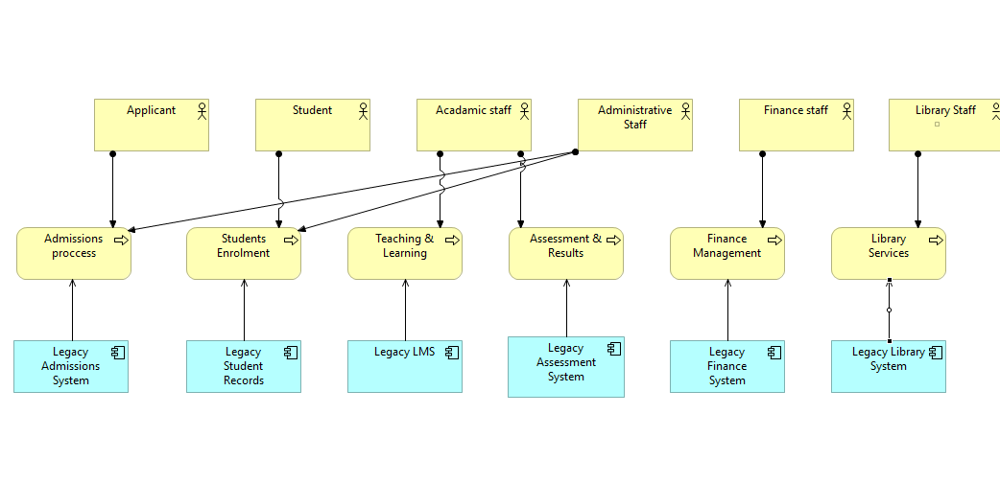
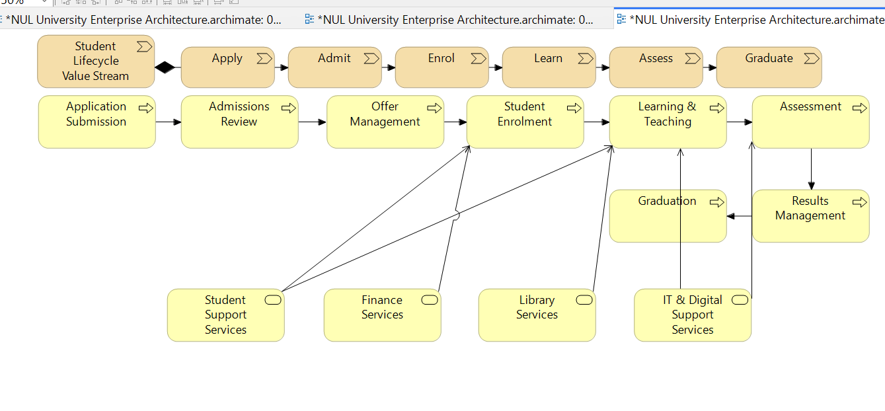
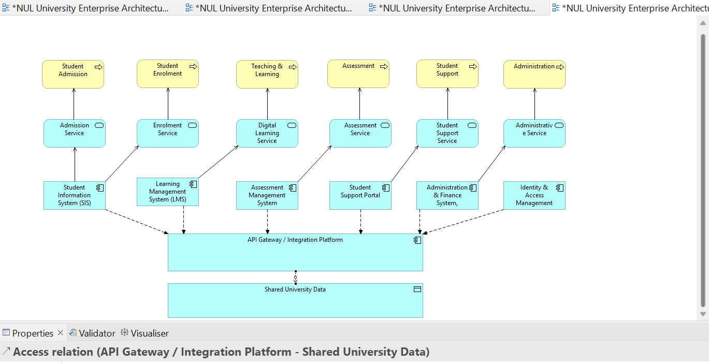
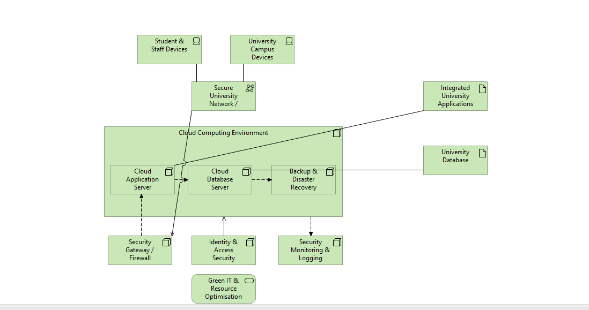
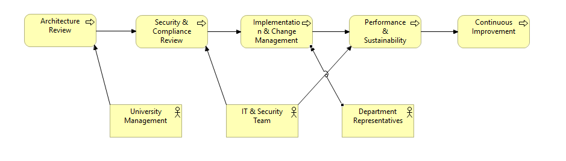

# nul-enterprise-architecture
Enterprise Architecture design for NUL University using ArchiMate, covering business, application and technology architecture.
# 🏛️ NUL University — Enterprise Architecture Design

A comprehensive **Enterprise Architecture (EA)** design for a university digital environment, modelled using **ArchiMate** and the **Archi modelling tool**.

The architecture addresses fragmented university systems, remote accessibility, data security, application integration, cloud infrastructure and sustainable IT across the Business, Application and Technology layers.

---

## 📌 Project Overview

The project models the transformation of NUL University's digital architecture from fragmented legacy systems towards an integrated, secure and cloud-enabled environment.

The architecture considers the needs of key stakeholders including:

- Students
- Academic Staff
- Administrative Staff
- IT Team
- University Management

The proposed architecture focuses on:

- Integration of fragmented university systems
- Improved remote accessibility
- Secure access to university services
- Centralised and shared university data
- Application integration through APIs
- Cloud-enabled infrastructure
- Identity and access management
- Security monitoring and logging
- Backup and disaster recovery
- Sustainable and resource-efficient IT
- Architecture governance and continuous improvement

---

## 🧩 Architecture Scope

The solution is represented across several interconnected architecture perspectives:

1. **Architecture Vision**
2. **Business Architecture**
3. **Student Lifecycle Value Stream**
4. **Application Architecture**
5. **Technology Architecture**
6. **Architecture Governance**

Together, these views demonstrate how organisational requirements can be translated into business processes, application services and supporting technology infrastructure.

---

## 🎯 Architecture Vision

The Architecture Vision identifies major stakeholders, existing challenges, strategic goals and proposed responses.

Key challenges identified include:

- Fragmented IT systems
- Poor remote accessibility
- Security and data protection risks
- High energy consumption

The target outcomes include:

- Integrated university data
- Secure remote access
- Enhanced data security
- Sustainable and energy-efficient IT

Proposed architectural responses include API-based system integration, cloud-enabled digital services, stronger identity and access controls and cloud resource optimisation.



---

## 🏢 Business Architecture

The current business architecture illustrates how major university activities depend on separate legacy systems.

Business areas represented include:

- Admissions
- Student enrolment
- Teaching and learning
- Assessment and results
- Finance management
- Library services

The model highlights dependencies between university stakeholders, business processes and the supporting legacy applications.



---

## 🔄 Student Lifecycle Value Stream

The Student Lifecycle Value Stream models the journey from initial application through to graduation.

### Value Stages

`Apply → Admit → Enrol → Learn → Assess → Graduate`

Supporting business processes include:

- Application Submission
- Admissions Review
- Offer Management
- Student Enrolment
- Learning & Teaching
- Assessment
- Results Management
- Graduation

Supporting services include Student Support, Finance, Library and IT & Digital Support Services.



---

## 💻 Application Architecture

The Application Architecture introduces an integrated digital environment supporting core university services.

Key application components include:

- Student Information System (SIS)
- Learning Management System (LMS)
- Assessment Management System
- Student Support Portal
- Administration & Finance System
- Identity & Access Management

An **API Gateway / Integration Platform** provides an integration layer between university applications.

A **Shared University Data** layer supports improved information sharing and reduces isolation between systems.



---

## ☁️ Technology Architecture

The Technology Architecture provides the infrastructure required to support the proposed digital environment.

Key components include:

- Cloud Computing Environment
- Cloud Application Server
- Cloud Database Server
- Backup & Disaster Recovery
- Security Gateway / Firewall
- Identity & Access Security
- Security Monitoring & Logging
- Secure University Network
- Student & Staff Devices
- University Campus Devices
- University Database
- Integrated University Applications

The architecture also incorporates **Green IT & Resource Optimisation** to support more sustainable use of technology resources.



---

## 🔐 Security Architecture

Security is incorporated across the architecture rather than treated as a standalone component.

The design considers:

- Identity and access management
- Role-based access control
- Multi-factor authentication
- Encryption
- Security gateway / firewall
- Security monitoring and logging
- Backup and disaster recovery
- Secure university network access

These controls support the goal of improving data protection while enabling secure access to university digital services.

---

## ♻️ Sustainability

Sustainability is incorporated into the technology architecture through cloud resource optimisation and Green IT principles.

The architecture aims to reduce unnecessary resource consumption while supporting scalable digital services.

This is represented through:

**Green IT & Resource Optimisation**

and the strategic goal:

**Sustainable & Energy-Efficient IT**

---

## 🧭 Architecture Governance

The governance model establishes a continuous process for reviewing and improving the architecture.

The governance lifecycle includes:

`Architecture Review → Security & Compliance Review → Implementation & Change Management → Performance & Sustainability → Continuous Improvement`

Key participants include:

- University Management
- IT & Security Team
- Department Representatives

This provides a mechanism for maintaining alignment between technology, security, organisational requirements and continuous improvement.



---

## 🛠️ Tools & Concepts

| Area | Technologies / Concepts |
|---|---|
| Architecture Modelling | ArchiMate |
| Modelling Tool | Archi |
| Enterprise Architecture | Business, Application & Technology Architecture |
| Business Analysis | Stakeholders, processes, services and value streams |
| Integration | API Gateway / Integration Platform |
| Cloud | Cloud computing and resource optimisation |
| Security | MFA, RBAC, encryption, firewall and monitoring |
| Data | Shared University Data |
| Resilience | Backup & Disaster Recovery |
| Sustainability | Green IT & Resource Optimisation |
| Governance | Architecture review and continuous improvement |

---

## 📂 Repository Structure

```text
nul-enterprise-architecture/
│
├── README.md
│
└── diagrams/
    ├── architecture-vision.png
    ├── current-business-architecture.png
    ├── student-lifecycle-value-stream.png
    ├── application-architecture.png
    ├── technology-architecture.png
    └── architecture-governance.png
```

---

## 🎯 Skills Demonstrated

This project demonstrates practical understanding of:

- Enterprise Architecture
- ArchiMate modelling
- Business Architecture
- Application Architecture
- Technology Architecture
- Architecture Vision
- Stakeholder analysis
- Business process modelling
- Value stream modelling
- Digital transformation
- Systems integration
- API-based architecture
- Cloud architecture
- Identity and access management
- Cybersecurity architecture
- Data integration
- Backup and disaster recovery
- Sustainable IT
- Architecture governance

---

## 👤 Author

**Rudra Patel**

Computer Science Graduate | Software Development & IT

GitHub: [rudra112p](https://github.com/rudra112p)
